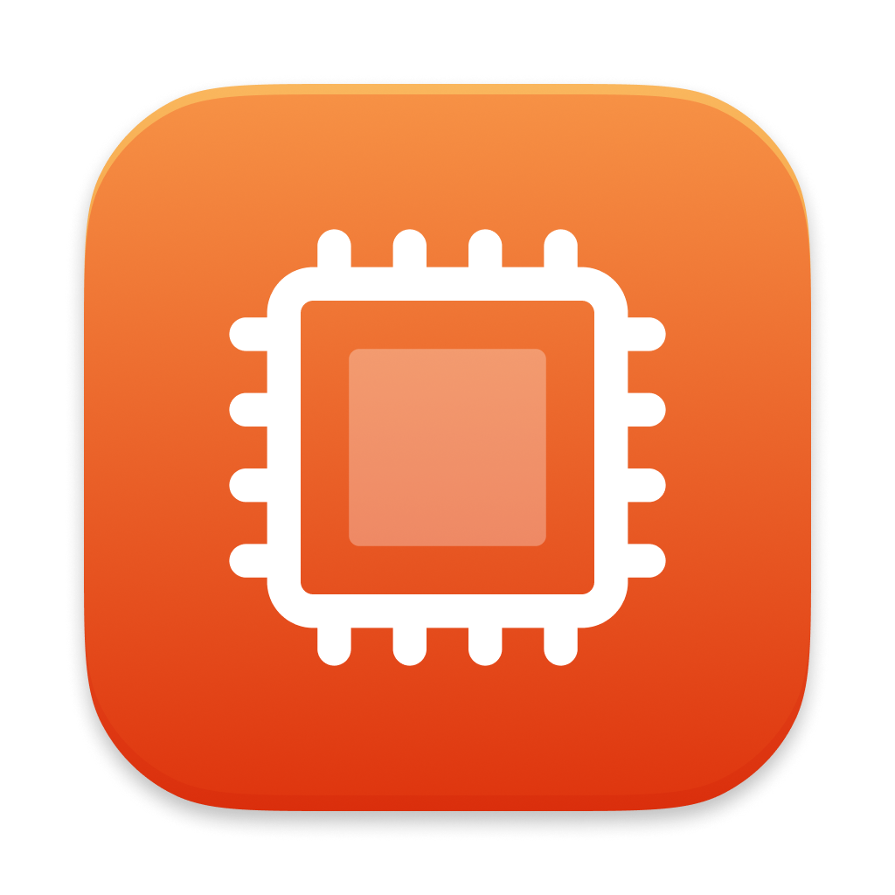
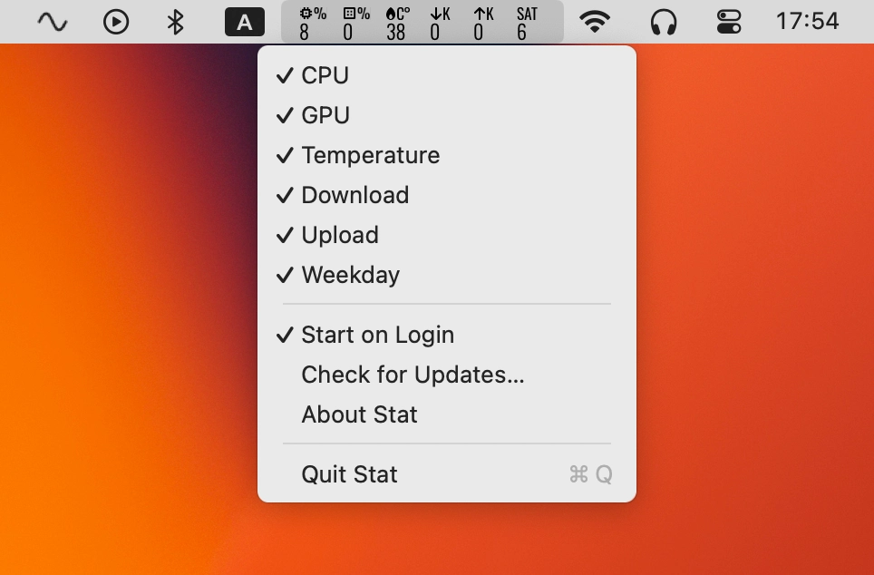

# Stat



Tiny menu bar app that shows CPU, GPU, temperature, network speed, and weekday at a glance.



## Install

1. Open **Terminal** (press ⌘Space, type "Terminal", press Enter)
2. Copy and paste this command, then press Enter:

```sh
/bin/bash -c "$(curl -fsSL https://raw.githubusercontent.com/vladstudio/stat/main/install.sh)"
```

3. The app will install to /Applications and open automatically

---

License: MIT
